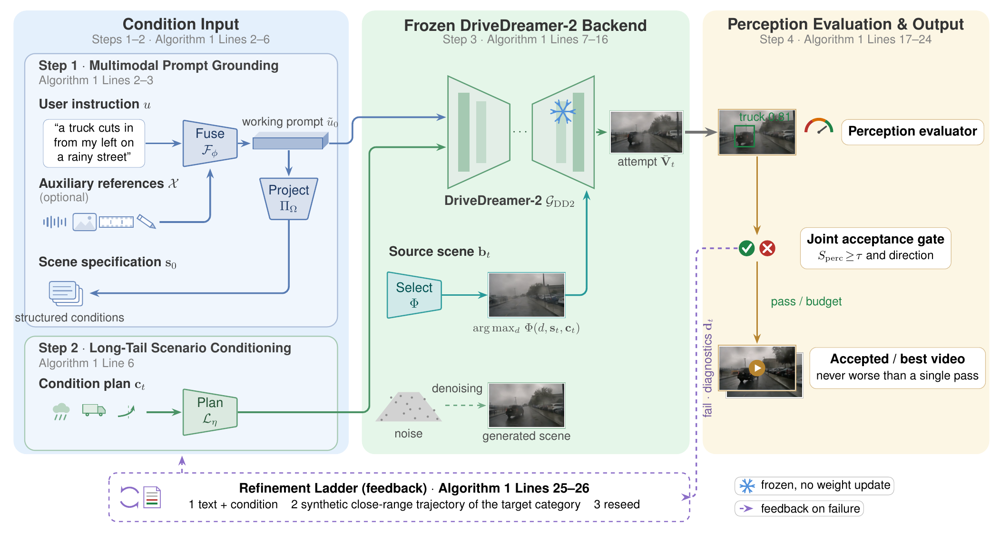
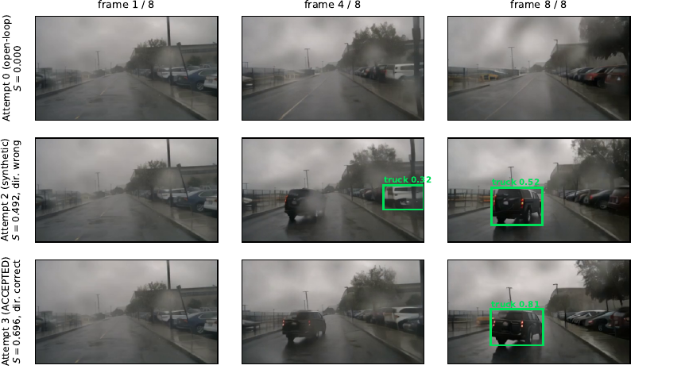
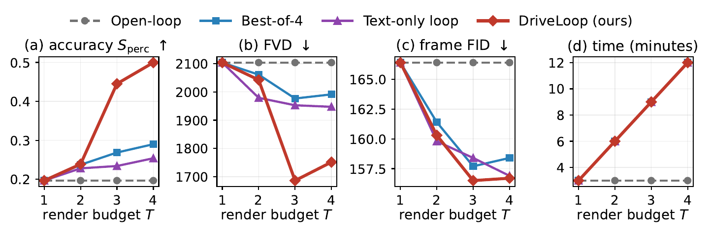

<div align="center">

# DriveLoop: Evaluation-Driven Closed-Loop Driving-Video Generation

</div>

DriveLoop wraps a **frozen** [DriveDreamer-2](https://drivedreamer2.github.io) (DD2) backend in a closed loop of **generation, evaluation, diagnosis, and refinement**. Each attempt is rendered on a real nuScenes source scene and scored by a perception-oriented evaluator (YOLOv8 + BoT-SORT). Failed attempts descend a refinement ladder: strengthen structured conditions and refine the prompt text (Rung 1), inject a synthetic close-range trajectory of the requested category (Rung 2), and reseed (Rung 3). Keep-best selection guarantees the returned video is never worse than the single pass. The backend weights are never updated.



## Example: a request every baseline fails

The user asks for *"a truck cuts in from my left on a rainy street."* The open-loop pass renders a convincing rainy street but no detectable truck (top row). The synthetic rung makes the truck appear and be detected, confidence 0.32 to 0.52, but it moves against the request, so the joint gate rejects it (middle row). The reseeded attempt is detected at 0.81 and cuts in from the left as requested, and this is the clip the loop accepts (bottom row). Best-of-4 resampling and text-only refinement both stay at score 0 on this request.



Generation is deterministic under the fixed seed bank, so every accepted clip can be re-rendered exactly from the records in `experiments/`.

## Key results

- Mean perception score on seven backend arms: **0.208 → 0.533** (+156% over single-pass DD2), 32/35 requests improve, 0 regress.
- At the same 4-attempt budget, DriveLoop beats best-of-4 resampling by **73%** (0.533 vs 0.308).
- Realism improves alongside accuracy: FID 166.4 → 156.7, FVD 2103 → 1752 against real nuScenes clips.
- One NVIDIA A10 (24 GB), fp16, about 3 minutes per attempt, at most about 12 minutes per request at T=4.

All strategies share the render budget T. The gap opens at T=3, where the ladder reaches the synthetic-trajectory rung:



## Repository layout

| Path | Contents |
| --- | --- |
| `driveloop/` | Core package: grounding, conditioning, source selection, DD2 backend adapter, evaluators, refiner, runner |
| `scripts/` | Experiment entry points (see below) |
| `scripts/audits/` | One-off diagnostic and audit tools used during development |
| `tests/` | Unit and integration tests (`pytest tests/`) |
| `experiments/` | Dated experiment records for every reported result |
| `results/` | Paper data: per-attempt scores (`driveloop_plotdata.json`), metric curves (`measurement_curves.json`) |
| `assets/` | README figures |
| `dreamer-datasets/`, `dreamer-models/`, `dreamer-train/` | Upstream DD2 runtime (frozen, unmodified weights) |
| `DOCS/` | DD2 environment setup: `install.md`, `preparation.md`, `trainval.md` |

## Setup

1. Follow `DOCS/install.md` and `DOCS/preparation.md` to set up the DD2 runtime, released DD2 weights, and nuScenes v1.0-trainval.
2. Python environment: PyTorch with CUDA, `ultralytics` (YOLOv8), and the DD2 dependencies. Local paths are configured in `ENV.py`.

## Running

Single request through the full closed loop:

```bash
python scripts/run_driveloop_drivedreamer2.py
```

Reproducing the paper experiments (T=4, seed bank 0):

```bash
python scripts/run_seven_arms_v10f.py      # backend-arm study (7 arms x 5 requests)
python scripts/run_pool_v10f.py            # object x condition pool (10 bindings)
python scripts/run_family_comparison.py    # strategy comparison on the motorcycle family
python scripts/run_baseline_comparison.py  # open-loop / best-of-4 / text-only baselines
python scripts/run_fid.py                  # frame-wise FID vs real nuScenes clips
python scripts/run_fvd.py                  # FVD vs real nuScenes clips
python scripts/quality_gate.py             # joint acceptance gate readout
python scripts/summarize_closed_loop.py    # aggregate tables
```

All runs are deterministic under the fixed seed bank. Every number reported in the paper has a matching record in `experiments/`.

## Tests

```bash
pytest tests/
```

## Acknowledgements

The generation backend is [DriveDreamer-2](https://github.com/f1yfisher/DriveDreamer2) (AAAI 2025). We use the officially released weights and runtime without modification. Source scenes come from the [nuScenes](https://www.nuscenes.org) dataset.

## License

Apache-2.0 (see `LICENSE`).
